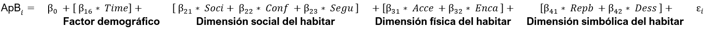

```{r setup, include=FALSE}
options(htmltools.dir.version = FALSE)
knitr::opts_chunk$set(
  fig.width=9, fig.height=3.5, fig.retina=3,
  out.width = "100%",
  cache = FALSE,
  echo = TRUE,
  message = FALSE, 
  warning = FALSE,
  hiline = TRUE
)
names(xaringan:::list_css())
```

```{r librerias-dataset, include=FALSE}
load("../1_input/data/procesada/elsoc.RData")
library(tidyverse)
library(broom)
library(texreg)
```

class: inverse, middle

# Estructura de la presentación

## I. Problema de investigación

## II. Teoría e hipótesis

## III. Método

## IV. Resultados

## V. Discusión

---

class: inverse, center, middle

# I. Problema de investigación

---

## Problema de investigación

--

### A. AMS ciudad fragmentada y desigual:

--

  -  Problemas de cohesión social a escala barrio.
    - problemas de apego al barrio: vínculo afectivo entre persona y lugar residencial (Scannel & Gifford, 2010)

--

### B. Hipótesis principal (ecológica): 

--

#### Segregación residencial a gran escala desencadena mecanismos que pueden causar _desintegración social_ y _desapego territorial_  (Sabatini et al. 2001; 2010).

--

  > Esfera política: detras de políticas públicas de mixtura social en el espacial.

--

  > Esfera científica: cohesión social dependería en último término de dinámicas socio-espaciales mayores o de mayor agregación (**efecto barrio o de lugar**).

--
  
### ¿Por qué esta explicación del apego resulta insuficiente?
  
---

class: middle right inverse
background-image: url('../ponencia-coes/gse-ams.png')
background-size: 450px
background-position: 10% 50%

--

### Segregación clase baja ~ (-) k social ~ (-) apego

--

### Segregación clase alta ~ (+) k social ~ (+) apego

--

### PERO, hipótesis ecológica... 

--

#### ... oculta mecanismos explicativos que generan <br> los problemas sociales (Ruiz-Tagle & López, 2014)

--

#### ... ignora la vivencia y significación del espacio urbano <br> (Jirón et al. 2010)

--

### **¿Siempre ocurre así?** 

--

### **¿Cómo surge el apego al barrio?**

---

class: inverse, center, middle

## II. Estado del arte e hipótesis

---

## Antecedentes empíricos: ¿cómo surge el apego?

####  1. Abordajes parcelados/indirectos

--

- socio-demográficas ~ apego (Comstock et al., 2010; Angelcos & Méndez, 2017)
- socio-relacionales ~ apego (Luneke, 2016; COES., 2017)
- físico-espaciales ~ apego (Greene et al., 2014; Angelcos & Méndez, 2016)
- simbólico-valóricas ~ apego (Elorza, 2019; Rasse & Lin, 2020)

--

#### 2. Abordajes sistemáticos/directos

--

- minoritarios, se basan en la _**satisfacción residencial**_ (Ramkissoon y Mavondo, 2015; Mao et al., 2015). 
  - (+) satisfacción residencial $\to$ (+) apego barrial
  - el apego es explicado por **evaluaciones** del lugar residencial.

--

#### 3. Problemas de los abordajes

--

- Parcelados **no explican el apego**, a lo sumo correlacionan sin controlar efectos.
- Indirectos tratan el apego como **epifenómeno**.
- Sistemáticos **desconocen dimensiones** relevantes (e.g. simbólica).
- La mayoría de las veces no **comparan hipótesis rivales**.

---

## Antecedentes conceptuales: 

1. **Apego al barrio**: _vínculo afectivo entre persona y lugar residencial_ (Scannel & Gifford, 2010)

  > nivel de pertenencia que la persona siente hacia el barrio (Bonaiuto, 2004; Schieffer & Van der Noll, 2016)

--

2. **Experiencia de habitar**: _vivencia significativa del territorio_ (Campos & Ojeda, 2020)
  > evaluación del lugar residencial en cuanto a su capacidad de brindar un buen vivir (Campos & Yávar, 2004)

--

  2.1. dimensión social: pautas de interacción social situadas en el barrio.
  
--

  2.2 dimensión física:  localización accesible del barrio a bienes y servicios.

--

  2.3 dimensión simbólica: distinciones conceptuales que categorizan al barrio.
  
--
  
#### <center> Habitar es un concepto amplio que permite agrupar determinantes del apego <br> y a la vez distinguirlos en función de las dimensiones del lugar. <center>

---

# Hipótesis

.center[]

--
> Todas la hipótesis indican efectos directos positivos -> (+) $X_i$ $\to$ (+) $Y_i$

---

class: inverse, center, middle

# III. Método


---

# Datos y muestra

--

- Análisis de datos trasversales de la primera ola de la encuesta ELSOC, correspondiente a una medición realizada el 2016

--

- Muestra ELSOC es probabilística, estratificada y por conglomerados, incluye un total de 2927 casos representativos a nivel nacional -> **Representativa para el AMS**

--

- Seleccionamos 720 casos pertenecientes al AMS, ya que las unidades de análisis y observación son habitantes urbanos de nacionalidad chilena, residentes del AMS, de entre 18 y 75 años

---

# Variables

```{r echo=FALSE}
DT::datatable(openxlsx::read.xlsx("../variables.xlsx", sheet = 3), class = "hover",
              options = list(pageLength = 9))
```

---

# Procedimiento analítico

### I. Regresión lineal múltiple (RLM)

--

> (1) ${\rm ApB}_i={\beta_0+\beta_{1i}*Dem}_{1i}+\ \varepsilon_i$

--

> (2) ${\rm ApB}_i={\beta_0+\beta_{1i}*Dem}_{1i}+\ \beta_{2i}*{\ ExpSoc}_{2i}+ εi$

--

> (3) ${\rm ApB}_i={\beta_0+\beta_{1i}*Dem}_{1i}+\ \beta_{2i}*{\ ExpSoc}_{2i}+\ {\beta_{3i}*ExpFis}_{3i}\ +\varepsilon_i$

--

> (4) ${\rm ApB}_i={\beta_0+\beta_{1i}*Dem}_{1i}+\ \beta_{2i}*{\ ExpSoc}_{2i}+\ {\beta_{3i}*ExpFis}_{3i}+\ {\beta_{4i}*ExpSim}_{4i}\ +\varepsilon_i$

--

- **RLM permite control estadístico del efecto de los factores explicativos**

--

### II. Inferencia multi-modelo (IMM)

--

  - Paso 1:  iterar diferentes combinaciones del modelo que mejor ajusta
  
--

  - Paso 2: rankear modelos iterados por criterio de información Akaike corregio (AICc) -> **busca parsimonia sin sacrificar poder explicativo**

---

class: inverse, center, middle

# IV. Resultados

---

# Comparación modelos (regresión lineal múltiple)

```{css, echo = F}
table {
  font-size: 14px;     
}
```

```{r echo = FALSE}
DT::datatable(openxlsx::read.xlsx("../3_output/tablas/cap1/tablas_cap1.xlsx", sheet = 3), 
              colnames = c('Dimensión', 'Variable', 'Modelo 1', 'Modelo 2', 'Modelo 3', 'Modelo 4'),
              class = "hover",
              options = list(pageLength = 9))
```

---

# Modelo parsimonioso (inferencia multimodelo)

```{r echo=FALSE}
tidy(lm(apbi ~ time + soci + cnfi + segu + acci + geni + repb + desi, data = elsoc), conf.int = TRUE) %>%
  subset(term != "(Intercept)") %>% 
  ggplot(aes(x = factor(term, level = c('desi','repbPositiva','repbNeutra','geni',
                                          'acci','seguAlta','seguMedia','cnfi','soci','time')),
             y = estimate, ymin = conf.low, ymax = conf.high)) +
  scale_x_discrete(labels=c("time" = "Tiempo de residencia", 
                              "soci" = "Sociabilidad barrial", "cnfi" = "Confianza en Vecinos",
                              "seguMedia" = "Seguridad barrial\n(Media)", 
                              "seguAlta" = "Seguridad barrial\n(Alta)", 
                              "acci" = "Accesibilidad barrial",
                              "geni" = "Encarecimiento barrial", "repbNeutra" = "Reputación barrial\n(Neutra)", 
                              "repbPositiva" = "Reputación barrial\n(Positiva)","desi" = "Deseabilidad social")) +
  geom_hline(yintercept = 0, color = 'red' ) + 
  geom_linerange() + 
  geom_point() + 
  ylab(label = "Tamaño de efecto sobre el apego barrial") +
  xlab(label = NULL) +
  coord_flip() +
  theme_minimal()
```

--



---

# Sintesis de resultados

--

1. **Modelo parsimonioso** explica en buena medida la varianza del apego barrial -> $R^2ajustado = 0.48$ 

--

2. No es posible descartar ninguna dimensión de la experiencia de habitar, pero **factores sociales** tienen mayor capacidad explicativa que físicos y simbólicos. 

--

3. La **dimensión simbólica del habitar** es relevante para explicar el apego, aún cuando ha sido poco considerada por la literatura.

--

4. Los mejores factores explicativos del apego barrial son: **sociabilidad barrial** $\beta_{21} = 0.37$, **accesibilidad barrial** $\beta_{31} = 0.24$, y la **reputación positiva** del barrio $\beta_{41} = 0.30$; en la dimensiones _social_ , _física_ y _simbólica_ de la experiencia de habitar respectivamente.

--

5. No es posible descartar el **tiempo de residencia** $\beta_{16} = 0.17$, lo cual implica que el apego es un sentimiento desarrollado en el largo plazo. 

--

6. El tiempo de residencia no explica por sí solo la variabilidad del apego barrial, por lo cual el **apego no es un proceso espontaneo, sino susceptible de intervenir** en términos de mejorar la experiencia de habitar. 

---

class: inverse, center, middle

# V. Discusión

---

# Discusión

--

### 1. apego al barrio es un sentimiento multi-causal, no espontaneo y susceptible de intervención.

--

  - es recomendable hacer **modelos integrales**, que no desconozcan dimensiones en favor de otras.

--

  - no es recomendable simplificar a priori variables explicativas, pues **dificulta comparación de hipótesis**. 

--

  - apego **no depende ni exclusiva ni principalmente de características socio-demográficas** del habitante.

--

  - como indica la literatura, la dimensión social y física importa, pero también la **simbólica** para explicar el apego.

--

### 2. apego al barrio es fruto, no de atributos del barrio en sí, sino de la experiencia de habitarlo.

--

  - personas pueden significar un mismo atributo de diferente manera, por lo tanto es **necesario incorporar la perspectiva del habitante para estudiar e intervenir lugares**.

--

  - atributos del barrio no dejan de ser importantes, pero ellos no explican directamente el apego -> **¿efecto moderador?**

---

# Referencias

```{css, echo = F}
table {
  font-size: 12px;     
}
```

```{r echo = FALSE}
DT::datatable(openxlsx::read.xlsx("referencias.xlsx", sheet = 1),
              class = "hover",
              options = list(pageLength = 9))
```
---

class: inverse, center, middle

# Gracias por su atención!
**cristobal.ortiz.v@ug.uchile.cl**

