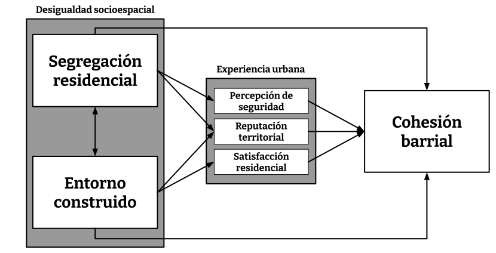

```{r setup, include=FALSE}
options(htmltools.dir.version = FALSE)
knitr::opts_chunk$set(
  fig.width=9, fig.height=3.5, fig.retina=3,
  out.width = "100%",
  cache = FALSE,
  echo = TRUE,
  message = FALSE, 
  warning = FALSE,
  hiline = TRUE
)
names(xaringan:::list_css())
```

```{r librerias-dataset, include=FALSE}
load("../1_input/data/procesada/elsoc.RData")
library(tidyverse)
library(broom)
library(texreg)
```

class: middle

# Contenidos de la presentación: 

###  I. Problema de investigación
### II. Estado del arte, vacío y pregunta
### III. Hipótesis
### IV. Método

---

class: inverse, center, middle

# II. Problema de investigación

---

## Problema de investigación

--

### A. Gran Santiago como ciudad segregada y diversa:

--

  -  Cohesión social se ha vuelto una preocupación pública (Consejo de Cohesión Social, 2020)
    - Cohesión barrial como escala geográfica abordable (incluso desde antes del Consejo)
--

### B. Principales  tesis para el caso chileno (Gran Santiago): 

--

- Deterioro de la cohesión barrial se debe a "efectos de barrio" en tres sentidos:

--

  - (1) Segregación de la vivienda social (familiar empobrecidas) en periferias excluidas geneneró una serie de dinámicas que terminaron por debilitar la "noción de barrio" (Sabatini et al., 2013). 

--

  - (2) Verticalización del centro y pericentro causan reconfiguraciones espaciales que dificultan prácticas de cohesión (Link, et al. 2021; Orellana, et al. 2022).

--

  - (3) Desigualdades socioespaciales favorecen "acumulación" de la cohesión barrial (Méndez, et al. 2020).

--

### Pregunta por la relación entre la desigualdad socioespacial y las formas de cohesión barrial

---

class: inverse, center, middle

## III. Estado del arte, vacío y pregunta

---

## Estado del arte, vacío y pregunta

### A. Estado del arte

**Concepto de cohesión barrial**

  - 

---

## Estado del arte, vacío y pregunta

### A. Estado del arte

--

1. **Hipótesis del contacto (efecto de la segregación)**

  - a favor "heterofilia": (+) mixtura social (↓ segregación) $\to$ (+) cohesión (Sabatini et al. 2013)
  - en contra "homofilia": (+) mixtura social (↓ segregación) $\to$ (-) cohesión (Putnam, 2007)
  - salvedades: (+) segregación $\to$ (+-) cohesión; depende de la acumulación y prestigio (Méndez et al. 2020)

--

2. **Geografías del encuentro (efecto del entorno construido)**

  - vitalidad urbana: (+) mixtura de usos $\to$ (+) cohesión "práctica" (Jacobs, 1967)
  - familiaridad pública: (+) espacios públicos $\to$ (+) cohesión "simbólica" (Blokland & Nast, 2014)
  - salvedades: (+) densidad/mixtura usos $\to$ (-) cohesión (Link, et al. 2022)

--

3. **Mecanismos cognitivos (efecto de experiencias de malestar)**

  - reputación territorial: (-) reputación $\to$ (-) cohesión (Wacquant et al., 2014; (Alvarez & Ruiz-Tagle, 2022)
  - sentimiento de seguridad: (-) seguridad $\to$ cohesión (Dammert, 2004; Luneke, 2016)
  - satisfacción residencial: (+) satisfacción $\to$ (+) cohesión (Ramkissoon & Mavondo, 2015)

---
## Estado del arte, vacío y pregunta

### B. Vacíos investigativos

--

1. **d**

--

2. **d**

  - Oculta **mecanismos explicativos** que generan los problemas sociales (Ruiz-Tagle & López, 2014)
  - Ignora la **vivencia y significación** del espacio urbano (Jirón et al. 2010)
  - No siempre evalúa ni mide el **rol del espacio**, lo da por sentado (Galster, 2012)
  - una cosa es que en barrios segregados existan problemas, *otra es que la segregación efectivamente contribuya a causarlos*.
  
---
## Estado del arte, vacío y pregunta

### C. Pregunta: 
***¿Cómo ha influido la segregación residencial y la calidad del entorno construido, a través de diferentes experiencias urbanas, en las formas de cohesión barrial percibida por los residentes de Santiago de Chile entre 2018 y 2022?***



---

class: inverse, center, middle

# IV. Método


---
# Método

## Caso de estudio

---
# Método

## Datos y muestra

.pull-left[
- Nivel micro (actitudes, creencias y percepciones): datos trasversales de la primera ola de la encuesta ELSOC, correspondiente a una medición realizada el 2016.
- Nivel macro (atributos territoriales): datos transversales de CIT a escala zona (186) y distrito (168).
]

--
.pull-right[
- Muestra ELSOC es probabilística, estratificada y por conglomerados, incluye un total de 2927 casos representativos a nivel nacional -> **Representativa para el AMS**
- Seleccionamos 720 casos pertenecientes al AMS, ya que las unidades de análisis y observación son habitantes urbanos de nacionalidad chilena, residentes del AMS, de entre 18 y 75 años
]

---
# Método

## Variables

```{r echo=FALSE}
DT::datatable(openxlsx::read.xlsx("../variables.xlsx", sheet = 9), class = "hover",
              options = list(pageLength = 11))
```

---
# Método

## Procedimiento analítico

---

class: inverse, center, middle

# Gracias por su atención!
## Conversemos 😄
**cristobalortizvi@gmail.com 📧**

